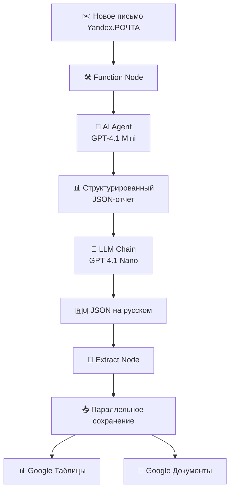

# 🧠 AI Email Processor for n8n - Анализ писем с искусственным интеллектом

# 📧 AI Email Processor for n8n

Автоматизированный workflow для n8n, который превращает входящие emails в структурированные идеи для практического применения. Система анализирует, суммирует и генерирует практические идеи из писем, сохраняя результаты в Google Workspace.

## 💡 Основная идея

Почтовый ящик переполнен, а времени разбирать письма нет? Это решение автоматически:
- 📖 Читает и анализирует входящие письма
- 🎯 Создает краткую выжимку содержания
- 💡 Генерирует идеи для практического применения
- 💾 Сохраняет все результаты в удобном формате

## 💰 Экономическая эффективность

**Полная стоимость обработки одного письма: менее 2.5 рублей**

| Компонент | Стоимость |
|-----------|-----------|
| 🖥️ Хостинг (n8n) | 1.34 ₽ |
| 🤖 AI-обработка (API) | ~1 ₽ |
| **Итого** | **~2.34 ₽** |

> 💡 Экономит 10-15 минут вашего времени на каждое письмо!

## 🛠 Технический стек

- **Платформа**: [n8n](https://n8n.io/)
- **AI модели**: GPT-4.1 Mini/Mini
- **Хранилище**: Google Sheets + Google Docs
- **Почта**: Yandex.POЧTA (поддерживаются другие провайдеры)

## 📊 Как это работает

# Детализация ключевых этапов обработки писем

Этот проект автоматизирует процесс анализа и обработки входящих писем из [translate:Яндекс.Почты] с использованием различных узлов и моделей ИИ, оптимизируя расходы и повышая эффективность.

## Этапы обработки

### 1. ⚡ Триггер  
[translate:Перехват нового письма из Яндекс.Почты].

### 2. 🧹 Очистка  
Функция `Function Node` программно очищает текст от HTML-разметки — это гораздо дешевле, чем использование ИИ.

### 3. 🤖 Анализ (AI Agent)  
Модель [translate:GPT-4.1 Mini] анализирует подготовленный текст:  
- При необходимости переводит его на английский.  
- Генерирует детальный JSON-отчет со следующими полями:  
  - `theme`: Тематика письма.  
  - `summary`: Краткая суть.  
  - `usefulness`: Потенциальная польза.  
  - `keyPoints`: Ключевые мысли (5 пунктов).  
  - `practicalIdeas`: Идеи для применения (3 идеи).

### 4. 🌐 Перевод (LLM Chain)  
Бюджетная модель [translate:GPT-4.1 Nano] переводит итоговый JSON на русский язык, что позволяет оптимизировать расходы.

### 5. 🔍 Извлечение данных  
`Extract Node` разбирает JSON на отдельные переменные.

### 6. 💾 Сохранение  
Результаты параллельно записываются в:  
- [translate:Google Таблицы] (для общего обзора).  
- [translate:Google Документы] (для удобного детального чтения).

# 💰 Экономическое обоснование

Мы тщательно подобрали модели AI, чтобы обеспечить высокое качество анализа при минимальной стоимости.

| Компонент           | Модель                  | Назначение                                     | Средняя стоимость |
|---------------------|-------------------------|-----------------------------------------------|------------------|
| 🔍 Сложный анализ    | [translate:GPT-4.1 Mini]    | [translate:Генерация структурированного JSON-отчета] | ~1.00 ₽          |
| 🔄 Простой перевод   | [translate:GPT-4.1 Nano]    | [translate:Перевод JSON на русский язык]          | Учтено в стоимости|
| ☁️ Инфраструктура    | n8n (хостинг)            | [translate:Запуск и выполнение всего процесса]       | ~1.34 ₽          |

**Итог:** [translate:Полная обработка одного письма обходится менее чем в 2.5 ₽].

---

# 🗺️ Перспективы развития

### 🎯 Приоритизация  
[translate:Настройка фильтров для обработки писем только от важных отправителей или с ключевыми словами, что позволит снизить количество запусков и затраты].

### 📈 Масштабирование  
[translate:Подключение дополнительных почтовых ящиков и мессенджеров (Telegram/WhatsApp) для уведомлений о готовом анализе].

### 🦾 Персонализация  
[translate:После сбора достаточного объема данных система может быть дообучена, чтобы генерировать идеи, наиболее релевантные именно для ваших задач].

> 🇷🇺 Русскоязычный проект | Portfolio project
