# 🚀 Блок-схема AI Email Processor

---

## 📋 Обзор процесса
*Автоматизированная система анализа писем и генерации контента с использованием AI*

```mermaid
graph TD
    A[🎯 Старт<br>✉️ Email Trigger IMAP] --> B[🛠️ Data Preprocessing<br>Code in JavaScript];
    B --> C[🧠 AI Анализ<br>GPT-4.1 Mini<br>Глубокий анализ + JSON отчет];
    C --> D[🌐 Перевод<br>Basic LLM Chain<br>GPT-4.1 Nano];
    D --> E[📊 Извлечение данных<br>Information Extractor];
    
    E --> F{🔀 Разделение потока};
    F --> G[💾 Параллельное сохранение];
    
    subgraph "📥 Сохранение результатов"
        G --> H[📊 Google Sheets<br>Append row in sheet];
        G --> I[📄 Документация<br>Create + Update document];
    end
    
    style A fill:#e1f5fe
    style C fill:#f3e5f5
    style E fill:#e8f5e8
    style H fill:#fff3e0
    style I fill:#fce4ec
```

