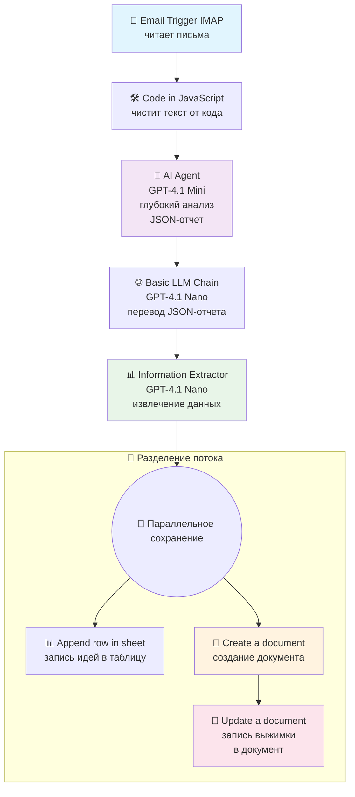

# 🚀 Блок-схема AI Email Processor

---

## 📋 Обзор процесса
*Автоматизированная система анализа писем и генерации контента с использованием AI*

```mermaid
graph TD
    A[🎯 Email Trigger IMAP<br>читает письма] --> B[🛠️ Code in JavaScript<br>чистит текст от кода];
    B --> C[🧠 AI Agent<br>GPT-4.1 Mini<br>глубокий анализ<br>JSON-отчет];
    C --> D[🌐 Basic LLM Chain<br>GPT-4.1 Nano<br>перевод JSON-отчета];
    D --> E[📊 Information Extractor<br>GPT-4.1 Nano<br>извлечение данных];
    E --> F((💾 Параллельное сохранение));

    subgraph "🔀 Разделение потока"
        F --> G[📊 Append row in sheet<br>запись идей в таблицу];
        F --> H[📄 Create a document<br>создание документа];
        H --> I[📄 Update a document<br>запись выжимки<br>в документ];
    end
    
    style A fill:#e1f5fe
    style C fill:#f3e5f5
    style E fill:#e8f5e8
    style H fill:#fff3e0
    style I fill:#fce4ec
    class A,B,C,D,E,F,G,H,I standardWidth
    %%classDef standardWidth width:300px
```
